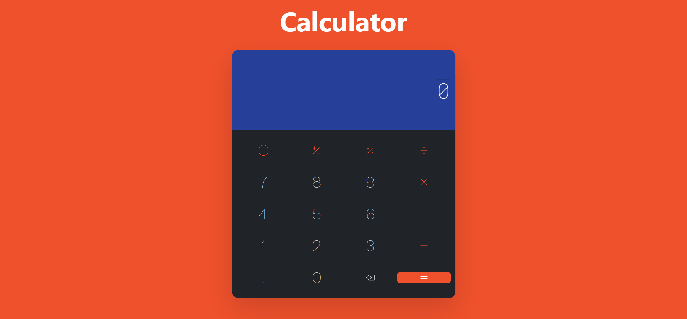

# Calculator App

## Overview

This is a simple calculator web application built using React and TypeScript. It uses the NextUI component library for UI elements and Tailwind CSS for styling. This calculator app allows you to perform basic arithmetic operations like addition, subtraction, multiplication, and division, as well as additional functions like percentage and negation.

## Features

- Basic arithmetic operations: addition, subtraction, multiplication, division
- Additional functions: percentage (%) and negation (±)
- Clear button to reset the input
- Backspace button to remove the last digit
- Error handling for division by zero and invalid input
- History log of calculations
- Responsive design for various screen sizes

## Prerequisites

Before you start, ensure you have the following installed:

- Node.js: Make sure you have Node.js installed. You can download it from [nodejs.org](https://nodejs.org/).

## Usage

- Click on the calculator buttons to input numbers and perform operations.
- Use the "C" button to clear the input and history.
- Click the backspace button to remove the last digit.
- The history log displays your previous calculations.
- The calculator handles errors, such as division by zero and invalid input.

## Technologies Used

- React
- TypeScript
- NextUI (Component Library)
- Tailwind CSS (Styling)

## License

This project is licensed under the MIT License - see the LICENSE.md file for details.
